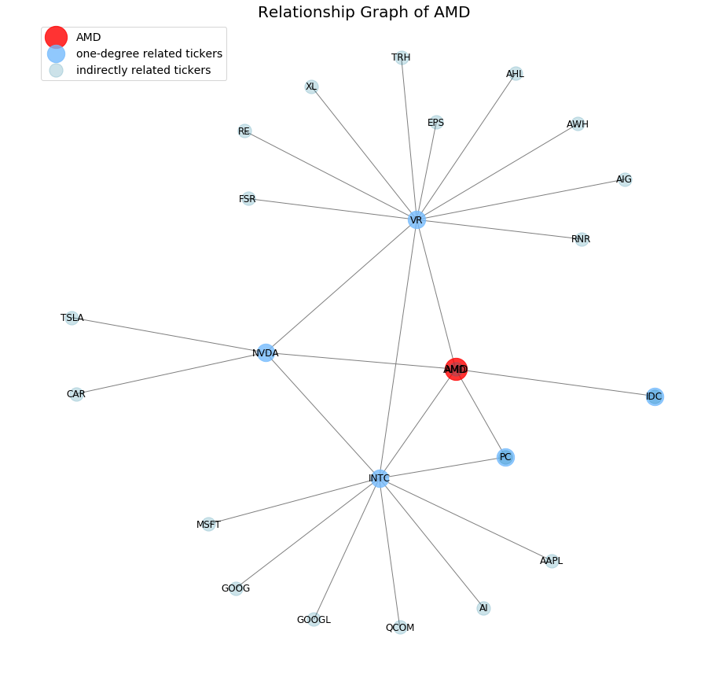

# Stock Relationship Extraction from News

This project used Embedding Model to extract the relationship among stocks from stock news from several sources. This repository does not provide any raw data and the results (relationship among stocks).

AMD, AAPL, FB, GS, TSLA, WMT

